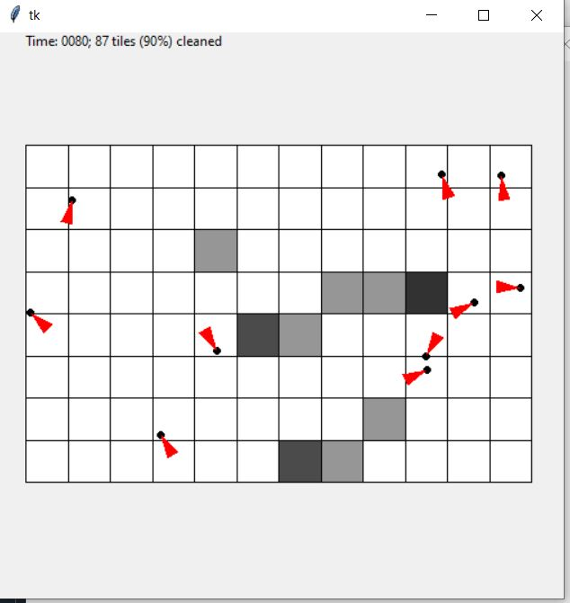

# MITOCW_6.0002_Asg3-Simulating_Room_Cleaning_by_Robots
Simulates dirty rooms (with/out furniture) and robot types using Python classes. Animates cleaning action

Concepts used:
1. Python classes and inheritance. 
2. Random library functions
3. Pylab animations for the robot's tile cleaning actions

Screenshot of 10 robots cleaning a 10x10 empty (no furniture) room

